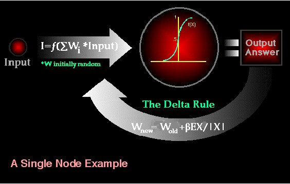

  
# [A Basic Introduction To Neural Networks](http://pages.cs.wisc.edu/~bolo/shipyard/neural/local.html)

[TOC]

## What Is A Neural Network?

The simplest definition of a neural network, more properly referred to as an 'artificial' neural network (ANN), is provided by the inventor of one of the first neurocomputers, Dr. Robert Hecht-Nielsen. He defines a neural network as:

> "...a computing system made up of a number of simple, highly interconnected processing elements, which process information by their dynamic state response to external inputs.
In "Neural Network Primer: Part I" by Maureen Caudill, AI Expert, Feb. 1989

ANNs are processing devices (algorithms or actual hardware) that are loosely modeled after the neuronal structure of the mamalian cerebral cortex but on much smaller scales. A large ANN might have hundreds or thousands of processor units, whereas a mamalian brain has billions of neurons with a corresponding increase in magnitude of their overall interaction and emergent behavior. Although ANN researchers are generally not concerned with whether their networks accurately resemble biological systems, some have. For example, researchers have accurately simulated the function of the retina and modeled the eye rather well.

Although the mathematics involved with neural networking is not a trivial matter, a user can rather easily gain at least an operational understanding of their structure and function.

## The Basics of Neural Networks

Neural neworks are typically organized in layers. Layers are made up of a number of interconnected 'nodes' which contain an 'activation function'. Patterns are presented to the network via the 'input layer', which communicates to one or more 'hidden layers' where the actual processing is done via a system of weighted 'connections'. The hidden layers then link to an 'output layer' where the answer is output as shown in the graphic below.  

Most ANNs contain some form of 'learning rule' which modifies the weights of the connections according to the input patterns that it is presented with. In a sense, ANNs learn by example as do their biological counterparts; a child learns to recognize dogs from examples of dogs.

Although there are many different kinds of learning rules used by neural networks, this demonstration is concerned only with one; the delta rule. The delta rule is often utilized by the most common class of ANNs called 'backpropagational neural networks' (BPNNs). Backpropagation is an abbreviation for the backwards propagation of error.

With the delta rule, as with other types of backpropagation, 'learning' is a supervised process that occurs with each cycle or 'epoch' (i.e. each time the network is presented with a new input pattern) through a forward activation flow of outputs, and the backwards error propagation of weight adjustments. More simply, when a neural network is initially presented with a pattern it makes a random 'guess' as to what it might be. It then sees how far its answer was from the actual one and makes an appropriate adjustment to its connection weights. More graphically, the process looks something like this:

Note also, that within each hidden layer node is a sigmoidal activation function which polarizes network activity and helps it to stablize.

Backpropagation performs a gradient descent within the solution's vector space towards a 'global minimum' along the steepest vector of the error surface. The global minimum is that theoretical solution with the lowest possible error. The error surface itself is a hyperparaboloid but is seldom 'smooth' as is depicted in the graphic below. Indeed, in most problems, the solution space is quite irregular with numerous 'pits' and 'hills' which may cause the network to settle down in a 'local minum' which is not the best overall solution. How the delta rule finds the correct answer

Since the nature of the error space can not be known a prioi, neural network analysis often requires a large number of individual runs to determine the best solution. Most learning rules have built-in mathematical terms to assist in this process which control the 'speed' (Beta-coefficient) and the 'momentum' of the learning. The speed of learning is actually the rate of convergence between the current solution and the global minimum. Momentum helps the network to overcome obstacles (local minima) in the error surface and settle down at or near the global miniumum.

Once a neural network is 'trained' to a satisfactory level it may be used as an analytical tool on other data. To do this, the user no longer specifies any training runs and instead allows the network to work in forward propagation mode only. New inputs are presented to the input pattern where they filter into and are processed by the middle layers as though training were taking place, however, at this point the output is retained and no backpropagation occurs. The output of a forward propagation run is the predicted model for the data which can then be used for further analysis and interpretation.

It is also possible to over-train a neural network, which means that the network has been trained exactly to respond to only one type of input; which is much like rote memorization. If this should happen then learning can no longer occur and the network is refered to as having been "grandmothered" in neural network jargon. In real-world applications this situation is not very useful since one would need a separate grandmothered network for each new kind of input.

## How Do Neural Networks Differ From Conventional Computing?

To better understand artificial neural computing it is important to know first how a conventional 'serial' computer and it's software process information. A serial computer has a central processor that can address an array of memory locations where data and instructions are stored. Computations are made by the processor reading an instruction as well as any data the instruction requires from memory addresses, the instruction is then executed and the results are saved in a specified memory location as required. In a serial system (and a standard parallel one as well) the computational steps are deterministic, sequential and logical, and the state of a given variable can be tracked from one operation to another.

In comparison, ANNs are not sequential or necessarily deterministic. There are no complex central processors, rather there are many simple ones which generally do nothing more than take the weighted sum of their inputs from other processors. ANNs do not execute programed instructions; they respond in parallel (either simulated or actual) to the pattern of inputs presented to it. There are also no separate memory addresses for storing data. Instead, information is contained in the overall activation 'state' of the network. 'Knowledge' is thus represented by the network itself, which is quite literally more than the sum of its individual components.

## What Applications Should Neural Networks Be Used For?

Neural networks are universal approximators, and they work best if the system you are using them to model has a high tolerance to error. One would therefore not be advised to use a neural network to balance one's cheque book! However they work very well for:

- capturing associations or discovering regularities within a set of patterns;
- where the volume, number of variables or diversity of the data is very great;
- the relationships between variables are vaguely understood; or,
- the relationships are difficult to describe adequately with conventional approaches.

## What Are Their Limitations?

There are many advantages and limitations to neural network analysis and to discuss this subject properly we would have to look at each individual type of network, which isn't necessary for this general discussion. In reference to backpropagational networks however, there are some specific issues potential users should be aware of.

- Backpropagational neural networks (and many other types of networks) are in a sense the ultimate 'black boxes'. Apart from defining the general archetecture of a network and perhaps initially seeding it with a random numbers, the user has no other role than to feed it input and watch it train and await the output. In fact, it has been said that with backpropagation, "you almost don't know what you're doing". Some software freely available software packages (NevProp, bp, Mactivation) do allow the user to sample the networks 'progress' at regular time intervals, but the learning itself progresses on its own. The final product of this activity is a trained network that provides no equations or coefficients defining a relationship (as in regression) beyond it's own internal mathematics. The network 'IS' the final equation of the relationship.
- Backpropagational networks also tend to be slower to train than other types of networks and sometimes require thousands of epochs. If run on a truly parallel computer system this issue is not really a problem, but if the BPNN is being simulated on a standard serial machine (i.e. a single SPARC, Mac or PC) training can take some time. This is because the machines CPU must compute the function of each node and connection separately, which can be problematic in very large networks with a large amount of data. However, the speed of most current machines is such that this is typically not much of an issue.

## What Are Their Advantages Over Conventional Techniques?

Depending on the nature of the application and the strength of the internal data patterns you can generally expect a network to train quite well. This applies to problems where the relationships may be quite dynamic or non-linear. ANNs provide an analytical alternative to conventional techniques which are often limited by strict assumptions of normality, linearity, variable independence etc. Because an ANN can capture many kinds of relationships it allows the user to quickly and relatively easily model phenomena which otherwise may have been very difficult or imposible to explain otherwise.

