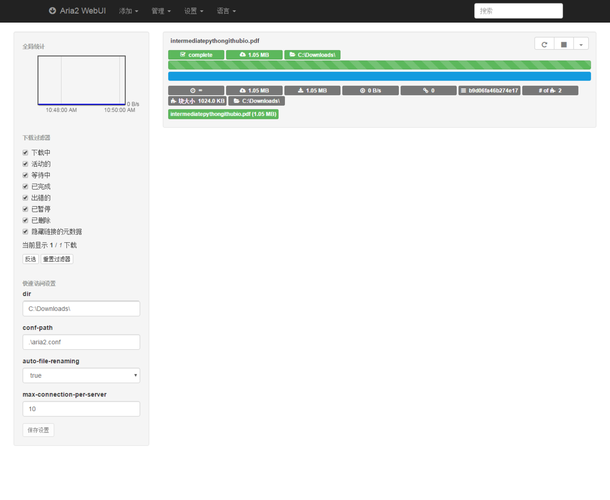

## aria2 使用笔记

# 主页

- [aria2](https://aria2.github.io/): [download](https://github.com/aria2/aria2/releases/tag)

> aria2 is a **lightweight** multi-protocol & multi-source command-line **download utility**. It supports **HTTP/HTTPS**, **FTP**, **SFTP**, **BitTorrent** and **Metalink**. aria2 can be manipulated via built-in **JSON-RPC** and **XML-RPC** interfaces.

## Aria2 Web 控制台

- [webui-aria2](https://github.com/ziahamza/webui-aria2): http://ziahamza.github.io/webui-aria2/#
- yaaw: https://binux.github.io/yaaw/demo/#
- aria2c: http://aria2c.com/
- uGet: http://uget.visuex.com/

## Windows

1.下载可执行文件到`C:\Program Files\aria2` ，并新建如下文件：
```
Aria2.log 
aria2.conf 
aria2.session 
aria2c.exe
```
2.将如下配置复制到`aria2.conf`文件中:
```
dir=C:\Downloads\
log=C:\Program Files\aria2\Aria2.log
input-file=C:\Program Files\aria2\aria2.session
save-session=C:\Program Files\aria2\aria2.session
save-session-interval=60
force-save=true
log-level=error

# see --split option
max-concurrent-downloads=5
continue=true
max-overall-download-limit=0
max-overall-upload-limit=50K
max-upload-limit=20

# Http/FTP options
connect-timeout=120
lowest-speed-limit=10K
max-connection-per-server=10
max-file-not-found=2
min-split-size=1M
split=5
check-certificate=false
http-no-cache=true

# FTP Specific Options

# BT/PT Setting
bt-enable-lpd=true
#bt-max-peers=55
follow-torrent=true
enable-dht6=false
bt-seed-unverified
rpc-save-upload-metadata=true
bt-hash-check-seed
bt-remove-unselected-file
bt-request-peer-speed-limit=100K
seed-ratio=0.0

# Metalink Specific Options

# RPC Options
enable-rpc=true
pause=false
rpc-allow-origin-all=true
rpc-listen-all=true
rpc-save-upload-metadata=true
rpc-secure=false

# Advanced Options
daemon=true
disable-ipv6=true
enable-mmap=true
file-allocation=falloc
max-download-result=120
#no-file-allocation-limit=32M
force-sequential=true
parameterized-uri=true
```
3.进到`C:\Program Files\aria2`目录，并执行如下命令，启动 aria2
```
λ aria2c.exe --conf-path=.\aria2.conf

07/04 10:42:38 [WARN] Neither --rpc-secret nor a combination of --rpc-user and --rpc-passwd is set. This is insecure. It
 is extremely recommended to specify --rpc-secret with the adequate secrecy or now deprecated --rpc-user and --rpc-passw
d.

07/04 10:42:38 [NOTICE] IPv4 RPC: listening on TCP port 6800
```

4.打开 [web-ui](http://ziahamza.github.io/webui-aria2/#)，即可使用



###参考链接

- [Windows中使用aria2下载](http://pandaju.me/article/209)
- [Windows下使用Aria2离线下载](https://0066.in/archives/520)


## Mac


###参考链接

- [Mac下载神器aria2](http://www.jianshu.com/p/1290f8e7b326)


## Linux

###参考链接
