# Platform IO 上手

[TOC]


## mbed 篇

### 准备材料

- 支持 mbed 的开发板子一块
- mbed 开发者账号一个
- 可连接互联网的机子一台（Windows/Linux/ macOS）
- Atom 及 Platform IO 开发环境 
- 各种外设硬件若干

### 新建工程

待环境安装完成，按照如下步骤可新建一个跑马灯的工程：

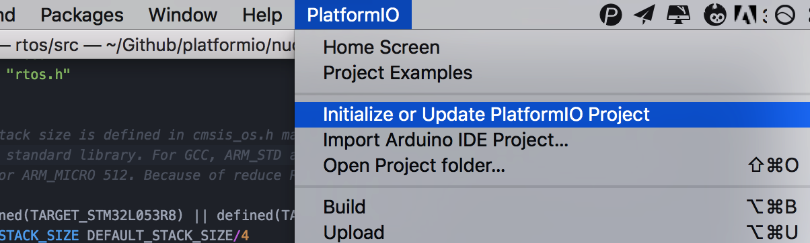

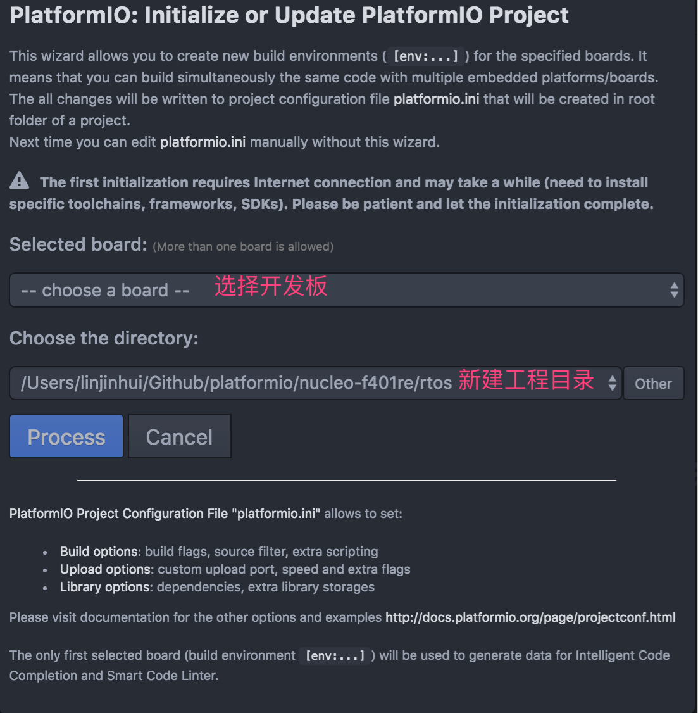

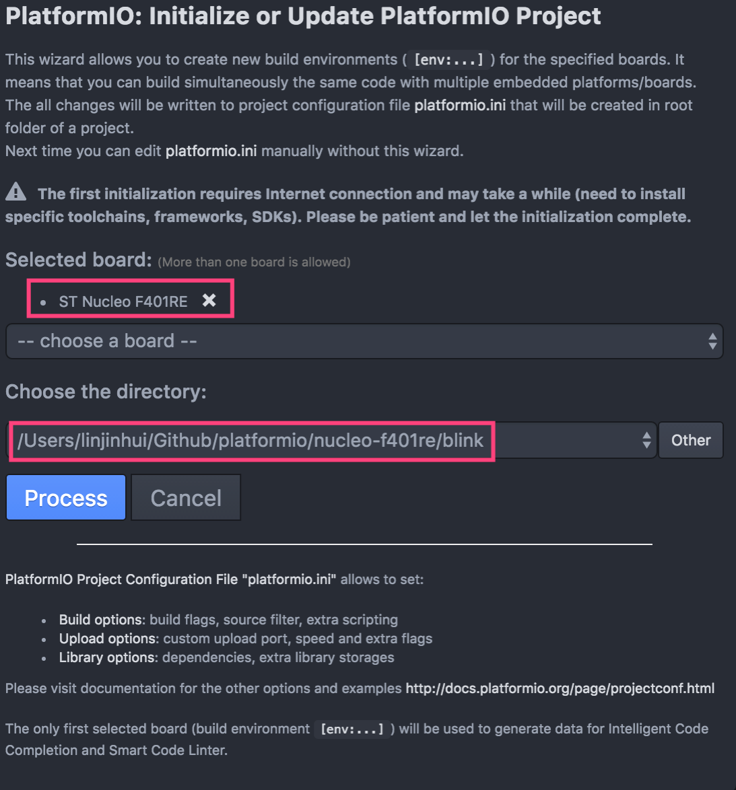


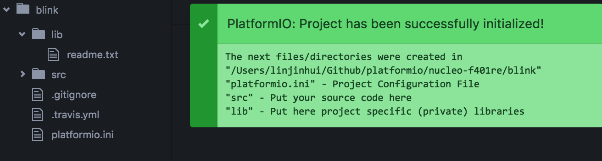


点击 `Process` 之后，Platform IO 会自动根据所选择的平台下载编译环境和所需要的库，如此处分别为 `arm-gcc` 和 `mbed` 库文件，将其保存到 `~/.platformio` 文件夹下:

```
➜  .platformio tree -d . -L 3
.
└── packages
    ├── framework-mbed
    │   ├── libs
    │   └── variant
    ├── ldscripts
    ├── tool-scons
    │   ├── engine
    │   └── script
    ├── tool-stlink
    └── toolchain-gccarmnoneeabi
        ├── arm-none-eabi
        ├── bin
        ├── lib
        └── share
```

然后，新建工程目录结构如下：

```
➜  blink tree .
.
├── lib
│   └── readme.txt
├── platformio.ini
└── src
```

此时，在 `src` 中添加 `main.cpp`：

```
#include "mbed.h"

DigitalOut myled(LED1);

int main() {
        while(1) {
                myled = 1; // LED is ON
                wait(0.2); // 200 ms
                myled = 0; // LED is OFF
                wait(1.0); // 1 sec
        }
}
```

编译之后，显示如下错误，但成功生成可执行文件：

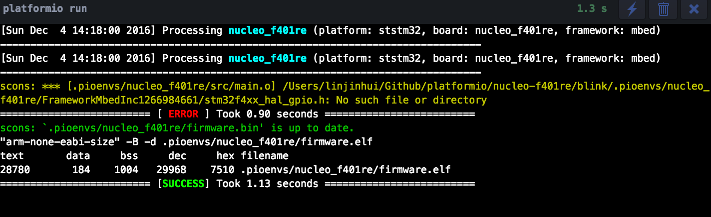

放狗一搜，同样有人碰到[此问题](https://github.com/platformio/platformio-core/issues/621)，需要重新建立工程索引`PlatformIO > Rebuild C/C++ Project Index (Autocomplete, Linter)`：

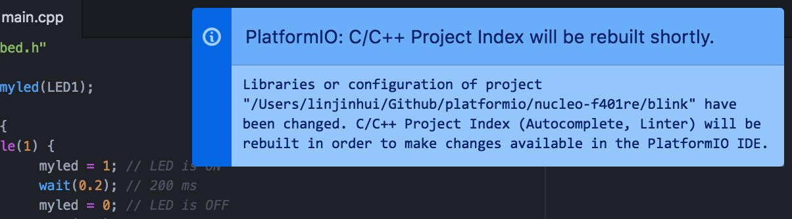

重新编译后，完美通过~

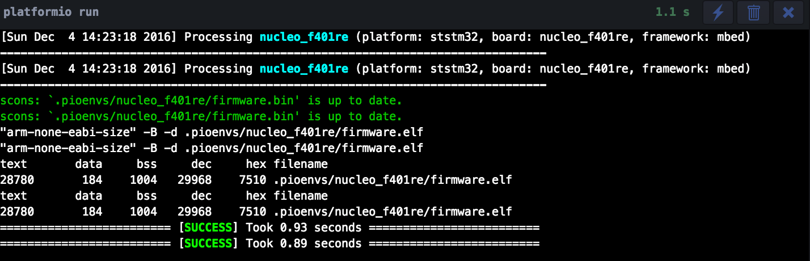

点击上传可以将编译完成的`elf`上传到板子上，值得一提的是 Platform IO会自动寻找是否有支持 mbed 的板子，并将程序上传到板子上。

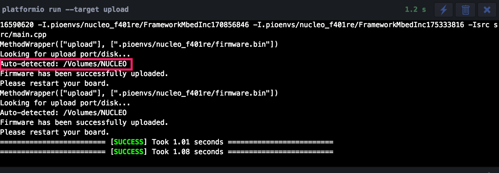

如果你不想 Platform IO 自己去找，也可以手动指定，修改 `platformio.ini`，增加`upload_port`板子的路径，如下：

```
#
# PlatformIO Project Configuration File
#
# Please make sure to read documentation with examples first
# http://docs.platformio.org/en/stable/projectconf.html
#
[env:nucleo_f401re]
platform = ststm32
framework = mbed
board = nucleo_f401re

upload_port = /Volumes/NUCLEO

```

注：在下载程序的过程中，还不小心遇到了`SWD error`的问题，重新插拔 USB 线后恢复正常。

新建工程可以通过菜单栏来，也可以直接手动新建如上的工程结构，然后编译的是否 Platform IO 同样会自动寻找依赖并安装，显示如下：

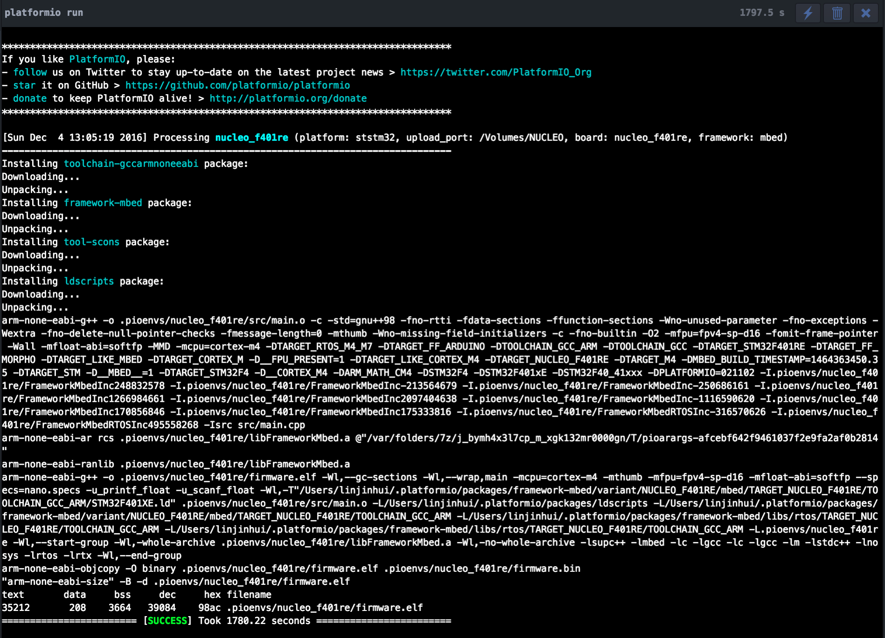


### 例程

#### 基础例程

##### 串口

串口是调试的利器，特别在没有仿真器的时候。

在写串口模块程序前，先看看是否已经连接上，方法如下：`Platform IO`->`List Serial Ports`


mbed 的串口程序非常简单，实例化一个 Serial 的实例即可，默认配置为波特率9600

```
#include "mbed.h"

//------------------------------------
// Hyperterminal configuration
// 9600 bauds, 8-bit data, no parity
//------------------------------------

Serial pc(SERIAL_TX, SERIAL_RX);

DigitalOut myled(LED1);

int main() {
        int i = 1;
        pc.printf("Hello World !\n");
        while(1) {
                wait(1);
                pc.printf("This program runs since %d seconds.\n", i++);
                myled = !myled;
        }
}
```

更新程序后，点击左侧的串口标志按钮，自动调出串口窗口如下：

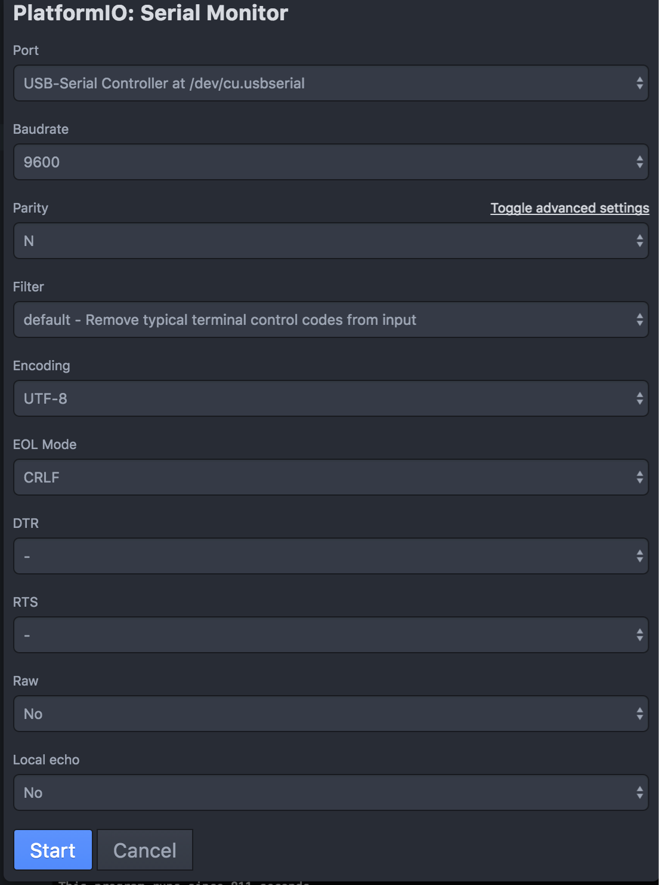

按照默认配置即可：

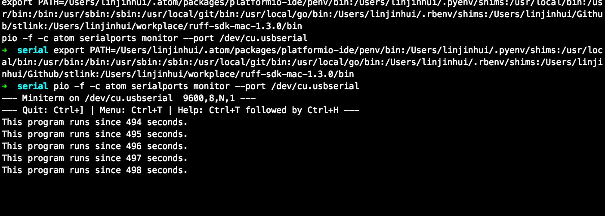

#### mbed-os

mbed-os 版本的跑马灯

```
#include "mbed.h"
#include "rtos.h"

/*
 * The stack size is defined in cmsis_os.h mainly dependent on the underlying toolchain and
 * the C standard library. For GCC, ARM_STD and IAR it is defined with a size of 2048 bytes
 * and for ARM_MICRO 512. Because of reduce RAM size some targets need a reduced stacksize.
 */
#if defined(TARGET_STM32L053R8) || defined(TARGET_STM32L053C8)
#define STACK_SIZE DEFAULT_STACK_SIZE/4
#else
#define STACK_SIZE DEFAULT_STACK_SIZE
#endif

void print_char(char c = '*') {
        printf("%c", c);
        fflush(stdout);
}

DigitalOut led1(LED1);
DigitalOut led2(LED2);

void led2_thread(void const *argument) {
        while (true) {
                led2 = !led2;
                Thread::wait(1000);
                print_char();
        }
}

int main() {
        Thread thread(led2_thread, NULL, osPriorityNormal, STACK_SIZE);

        while (true) {
                led1 = !led1;
                Thread::wait(500);
        }
}
```

#### 外设库

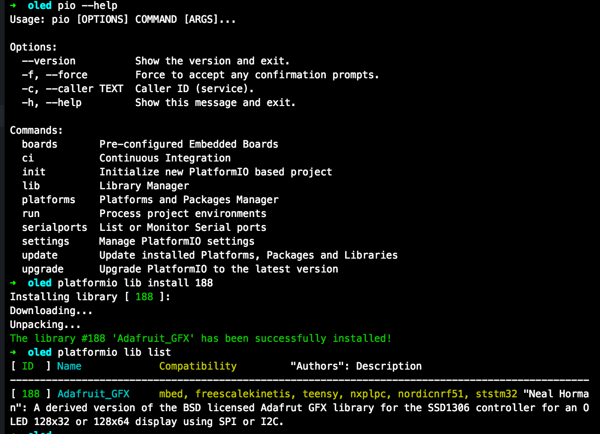


### 参考链接


## Arduino 篇

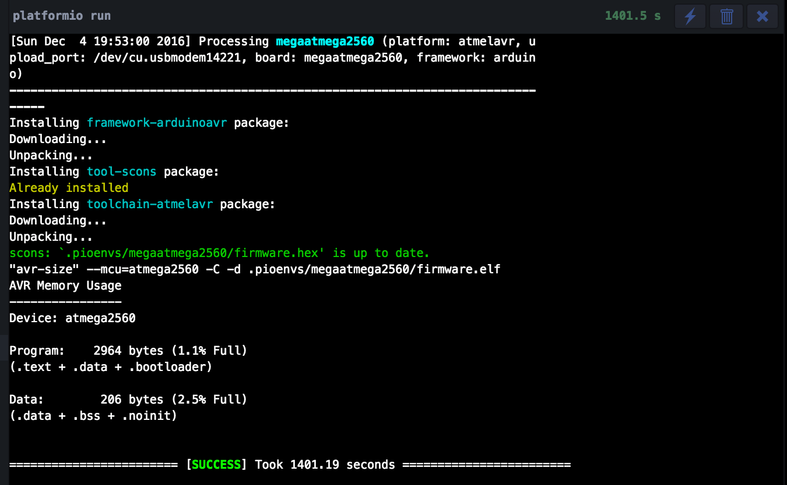

## 树莓派篇


## 总结

### 优点：集大成者

- 可以选择自己喜欢的编辑器，然后配置下插件环境即可，是原版在线和 IDE 的良好替代品，得益于 Atom 的好用和 Clang 的强大，比如
    + 好用的自动代码补全和定义跳转
    + 集成串口窗口，直接查看
    + 友好的错误和警告提示
- 同平台跨板子的支持很好，可以通过 `platformio.ini` 配置好，然后编译即可完成， Platform IO 就会自动下载相关依赖，这也得益于 Arduino 和 mbed 的良好抽象架构
- 方便使用各种库，包括 Arduino 和 mbed


## 不足

- 无法在线单步调试，只能通过串口打印来
- 需要单片机板子支持 Arduino 或者 mbed


另外，Platform IO 和 mbed-os 都处在快速的迭代过程中（既是好事，也是不足），碰到问题直接放狗搜索，然后一般都会定位到官方的社区或者 GitHub Issue 中找到类似的解决方案。

不过，目前蛮多的解决方案也是比较粗暴的，比如遇到一个`NUCLEO_F401RE.eix not found`的问题，找到[类似](https://community.platformio.org/t/enabling-nucleo-f401re-in-platformio/670)，维护者的解决方案是直接把 Platform 的配置目录给全部删除，然后再重新下载。


